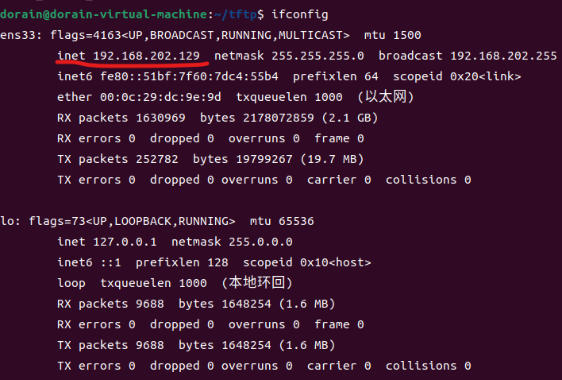
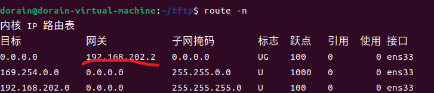
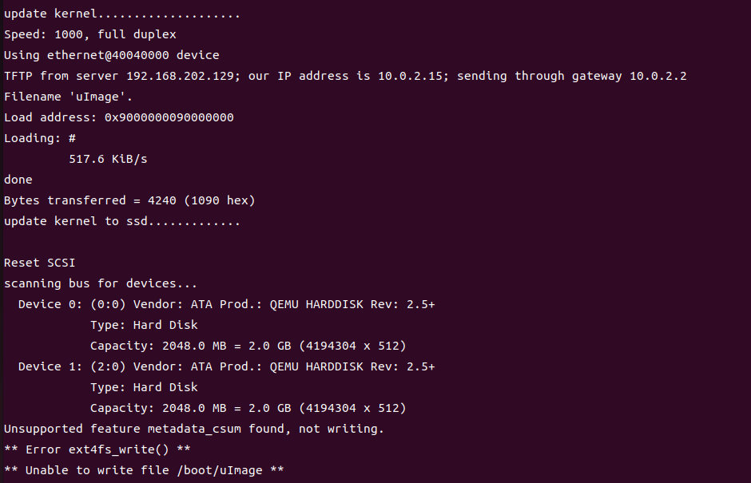

# 前言
本文档的内容包括：
- 使用uimage的的方式，使用基于qemu的龙芯2K1000模拟器与uboot启动基于LoongArch的操作系统
- 使用tftp的方式或者更新系统kernel的方式，使用基于qemu的龙芯2K1000模拟器启动操基于LoongArch的操作系统
- 附录包括了uboot的开发与使用过程，以及其他的边角信息

术语介绍：
- [龙芯2K1000模拟器](https://github.com/LoongsonLab/2k1000-materials/releases/tag/qemu-static-20240401):配置了相关参数，使用qemu的系统级模拟启动uboot的模拟器。能一定程度上模拟真实龙芯2K1000。是龙芯实验室开发，使用uboot作为BIOS，QEMU作为模拟器，对真实2K1000进行模拟的模拟器。这里使用的版本是20240126版本。  

made by 袁良卿 driftingcloudd@outlook.com

# 一 使用uImage的方式

## 基础逻辑
2K1000使用配置好的uboot作为BIOS，龙芯linux作为默认启动的kernel镜像文件。我们需要将编译好的镜像文件替换存在的qemu/2k1000/uImage
- 注意，不能更改uImage命名。可见qemu/2k1000/create_qemu_img.sh

## 步骤一：按照readme文件解压得到模拟器
- 注意，请严格按照readme文件执行。由于其在/tmp文件中执行，所以重启系统会清除其中的文件。需要将其安装在其他文件夹时，请自行修改脚本文件。
如果不放在/tmp文件夹， 需要修改/qemu/2k1000/create_qemu_img.sh,qemu/runqemu两个文件，保持耐心
- 执行到./create_qemu_image.sh 前即可停止。接下来脚本是基于操作系统镜像生成文件系统镜像并运行。
## 步骤二：编译内核，转换为镜像文件
这一步我们首先需要使用uboot的和uboot提供的工具mkimage。
### uboot编译与uboot工具获取
1. 获取uboot源代码，可以从官网或者学习资料包中获取。我使用的是u-boot-2022.04-devboard-src-28216f4-build.20240204140219.tar.gz
2. 解压，运行以下命令：  
```bash
CROSS_COMPILE=<compiler-prefix> make loongson_2k1000_dp_defconfig   

CROSS_COMPILE=<compiler-prefix> make

#<compiler-prefix>是交叉编译器的前缀。
```
如果你也是和我一样从资料包中获取的编译器，那么前缀就是loongarch64-linux-gnu-
3. 将/tools添加到PATH环境变量中
可以使用
`mkimage -l <uimage>` 
查看uimage文件信息

### 编译与装载内核
我们的内核会生成一个elf文件或者.bin文件。之后会写一个脚本生成uboot使用的uImage镜像格式。如果现在需要测试，可以运行以下对编译的elf文件使用命令：
``` bash
<compiler-prefix>-objcopy -O binary <kernel_name> <kernel_name>.bin 
# 这里生成bin文件是我们所说的image文件
mkimage -A LoongArch -O linux -T kernel -C none -a <load_adress>  -e <entry_point> -n '<uimage_name>' -d <data_file> <uimage_file_name>
# 这里生成的是uboot支持的镜像文件，即uimage文件
# load_adress建议值为0x00200000 ,entry_point建议使用objdump指令得到（入口地址与文件头的差值），这里以后可能会用自动化脚本优化
# data_file是输入的ELF文件的名字
# uimage_name与uimage_file_name随意。
# <entry_point>是程序入口地址与文件头的偏移。可以通过ld脚本查看入口函数地址(在微内核中是入口函数地址在.text节的头部)，再使用objdump与hexdump查找入口函数地址偏移
# 参考以下指令：loongarch64-linux-gnu-objdump -h <data_file>
```
将生成uImage文件替换模拟器中/2k1000下的uImage文件（生成镜像改名为uImage ），然后继续执行2k1000模拟器中的脚本即可启动kernel。
- 注：可以使用作为参考的操作系统中的[微内核](https://github.com/LoongsonLab/baremetal_kernel_2k1000)作为测试。或者 [xv6-loongarch](https://github.com/SKT-CPUOS/xv6-loongarch-exp.git)作为测试

# 二 使用tftp或更新kernel的方式
Uboot支持网络与U盘对固件与kernel进行更新。通过这个方法我们可以使用qemu启动uboot后启动我们编译好的kernel
## 搭建TFTP服务器
1. 下载tftpd-hpa
```bash
sudo apt-get install tftpd-hpa
```
2. 设定共享目录
```bash
mkdir ~/tftp
#我在主目录建立文件夹 ~/tftp
sudo chmod -R 777 ~/tftp
```
3. 修改配置文件
```bash
sudo chmod 777 /etc/default/tftpd-hpa
# 修改文件权限
vim /etc/default/tftpd-hpa

#/etc/default/tftpd-hpa

TFTP_USERNAME="tftp"
TFTP_DIRECTORY="/home/dorain/tftp"
# 这里修改成自己的目录。
#注意：使用~代替主目录似乎会出现bug
TFTP_ADDRESS=":69"
TFTP_OPTIONS="-l -c -s"
#-c: Allow new files to be created
#-s: Change  root  directory  on startup.
#-l:  Run the server in standalone (listen) mode, rather than run from inetd.
```
4. 重启服务
```bash
sudo service tftpd-hpa restart
```
5. 将要启动的kernel文件放在该目录下即可。如果要更新2K1000板子的kernel，请将名字改为uImage。如果只是要启动一个kernel，名字随意，请使用.bin格式的文件。这种文件可以通过
```bash
<pre-fix>objcopy -O binary <kernel_name> <kernel_name.bin>
# <pre-fix>是交叉编译系统的前缀，<kernel_name>是编译得到elf文件
```
得到

## 配置2K1000模拟器中Uboot的网络设置
1. 使用
```bash
 ifconfig
```
查看以太网卡的信息。示例如下： 

2. 使用
```bash
route -n
```
查看网关。示例如下：


不过现在好像没有用。应该只在更新uIamge镜像中有用  
3. 在2K1000模拟器中修改网络配置信息。运行runqemu脚本，按c进入uboot控制台。输入以下命令：
```bash
setenv ipaddr 10.0.2.15
# 设置本地ip地址。这里可能是qemu模拟的默认地址为10.0.2.15。但无论如何这是可行的
setenv gatewayip 10.0.2.2
# 设置网关ip。这里可能是qemu模拟的默认网关是10.0.2.2。但无论如何这是可行的
setenv serverip <ens-ip>
# 设置服务器ip地址，即网卡ip。我的服务器ip地址是192.168.202.129
env save
# 保存环境变量到flash中。否则重启后变量会改名。如果<Ctrl-c>退出似乎一样会需要重新设置环境变量
# 也有可能是因为没有实际的flash导致的
```
## 更新uImage镜像  注：待测试
这一部分内容是更新2K1000板子的上的kernel uImage。如果要在模拟器中启动一个kernel，请参考**下一节**
1. 输入
```bash
bootmenu
``` 
进入图形界面。选择“更新内核”选项，接着“通过tftp更新”。结果如下

可以看到成功加载了uImage文件。但似乎是因为没有实际的flash导致无法写入。可以之后用实际的板子测试
## 在2K1000模拟器中启动kernel
使用
```bash
tftpboot <load_address> ${serverip}:<kernel_name>
# <load_address>是kernel的加载地址。建议是ld脚本中中指定的起始地址（不是这个地址可能会有bug，还没弄清楚原因）
# 这里也可以不设置环境变量serverip直接传入之前查看的网卡ip
# <kernel_name>可以是objcopy得到的.bin文件，也可以是uImage文件

# 也可以使用以下命令
# tftp <load_addr> <kernel_name>

go <load_adress>
# 启动在<load_address>处的应用。通过objcopy -D查看入口函数的地址。
# 理论上来说.bin文件会去掉elf文件的元数据（比如elf_header segment_header section_header等），最开始就会是代码段，而入口函数在代码段的开头，
# 所以这里使用的地址与前面的命令相同
# 这一部分有问题就问我
```
启动kernel
# 附录
## 1 龙芯Linux的编译
- 目的：查看2k1000板子下linux的源代码，或许对开发有帮助  
Prerequisite: 交叉编译器
1. 获取linux源代码。从官网或是大赛的学习资料包。我是使用大赛的学习资料包
2. 在解压文件中的根文件运行命令 :
```bash
cp arch/loongarch/configs/loongson_2k1000_defconfig .config
make ARCH=loongarch CROSS_COMPILE=/opt/LoongArch_Toolchains/loongarch64-linux-gnu-2020-11-06/bin/loongarch64-linux-gnu- menuconfig
make ARCH=loongarch CROSS_COMPILE=/opt/loongson-gnu-toolchain-8.3-x86_64-loongarch64-linux-gnu-rc1.2/bin/loongarch64-linux-gnu- -j 8
# CROSS_COMPILE请填写自己的路径
#-j 8是线程数量。可以根据情况选择参数
# 编译过程中可能会要求安装某些库
```
3.  如果要在vscode中有良好阅读体验，请使用bear命令替代第三行：
```bash
bear -- make ARCH=loongarch CROSS_COMPILE=/opt/loongson-gnu-toolchain-8.3-x86_64-loongarch64-linux-gnu-rc1.2/bin/loongarch64-linux-gnu- -j 8
```
## 2 我的Uboot的获取与配置
### Uboot 配置
首先从官网上下载了Uboot的源码。发现Uboot并不支持LoongArch。查询大赛的相关文档与资源，并询问了大赛的老师后，最终得到了一份还在开发中的，支持LoongArch的Uboot。

但此时我还是不知道该如何使用这份代码。再次查阅Uboot的官方文档与相关资料，发现这些代码提供的实际上包括了TPL到SPL再到真正的Uboot的初始启动逻辑，即Uboot的启动过程；入口程序以及cpu的一些底层逻辑等。按照官方的文档说明。
我们首先要配置Uboot的一些基础options，这些options会改变Uboot在运行时逻辑与行为。比如CONFIG_SPL_TEXT_BASE决定了SPL启动代码的地址，CONFIG_SYS_LOAD_ADDR会决定Uboot加载操作系统的的默认地址在哪。再比如定义CONFIG_DEFAULT_DEVICE_TREE会影响设备树的使用。参考龙芯相关文档，按照龙芯的ABI、Uboot的一些特点以及地址空间的分配，再结合提供的头文件，我配置了一份config文件

由于Uboot启动时需要使用设备树文件搜索设备，所以接下来是设备树文件的配置。这个分支提供了2K1000的设备树，但似乎版本不一致。我学习了设备树源码.dts的相关知识，并阅读了2K1000的用户手册与参数手册，检查一遍后发现没有大问题，就可以进行对Uboot的编译了。首先进行之前的配置文件对Uboot进行设置，之后make便得到了一份二进制文件。

### 文件系统镜像的开发。
这一部分的内容主要是把要启动的内核装载到配置好的文件系统中，内容比较简单。我使用qemu-img创建了一个大小为2G，空的镜像文件，并把镜像文件连接到网络块设备ndb中，最后使用ext4文件系统对其初始化，把操作系统的uImage镜像放在/boot文件下即可。这样文件系统就完成了。
	最后便是qemu的启动。参考了其他操作系统的启动命令，我使用了-device模拟了固态硬盘 usb总线等设备（没有太关注细节），再加上之前配置的文件系统镜像，将BIOS配置为Uboot镜像文件 ，便完成了配置。

# 参考资料
- 广东龙芯2K1000星云板用户手册V1.2
- baremetal_kernel_2k1000的README.md文件

