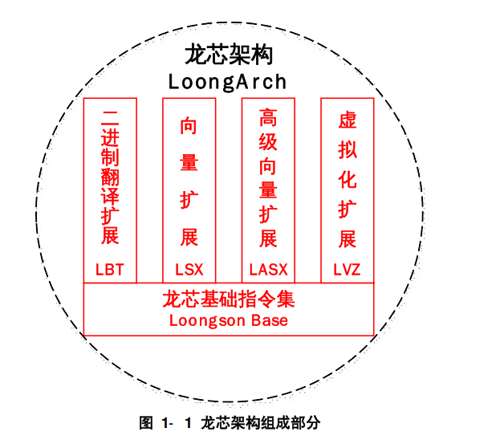
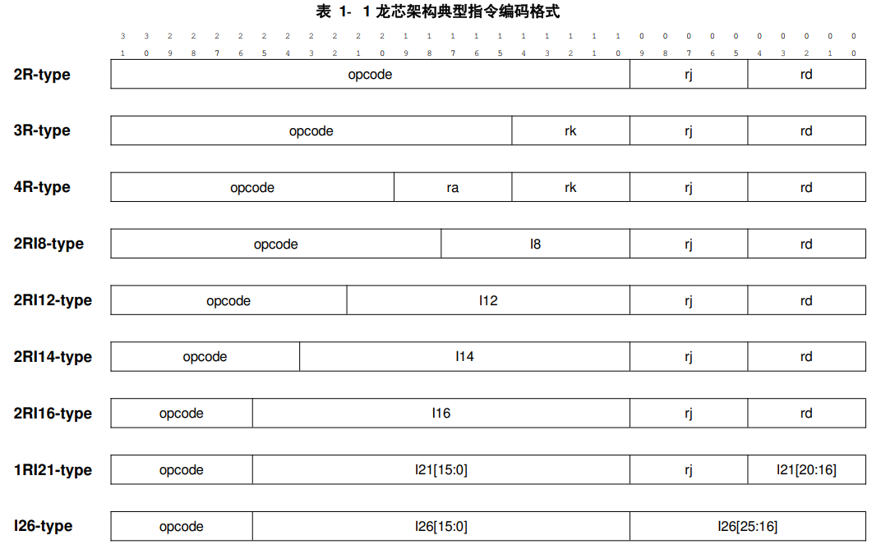
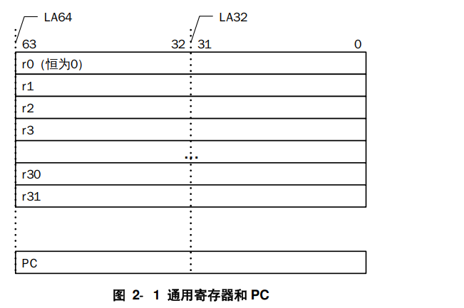
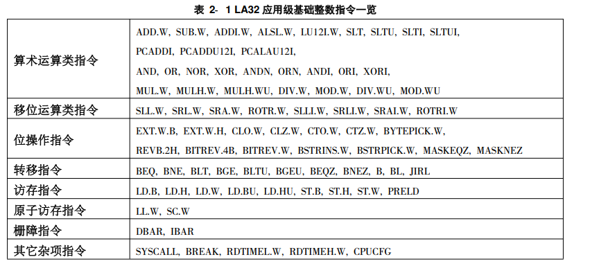
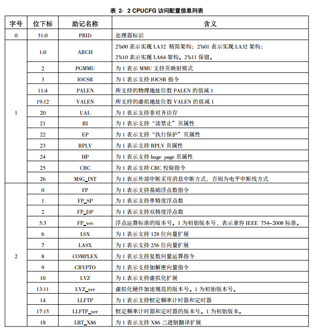
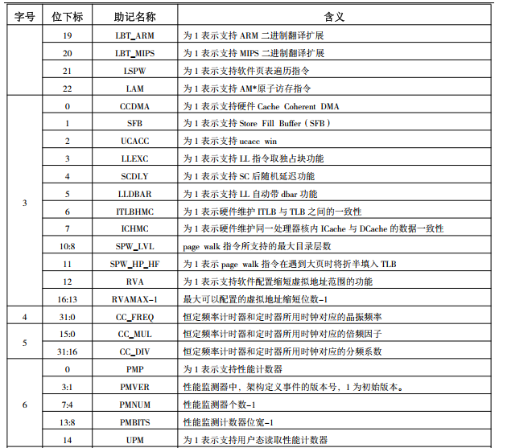
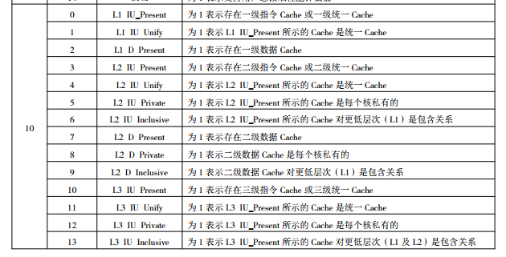
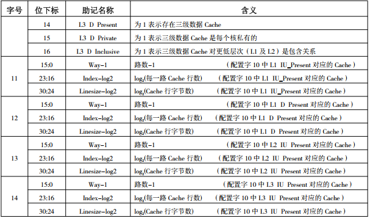
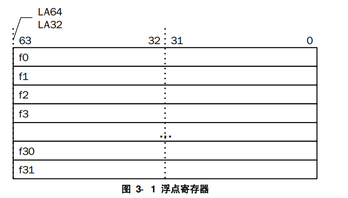
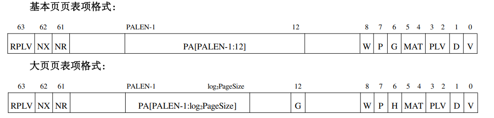

# 前言
本文档的内容包括：
- LoongArch架构的介绍，包括
    1. LoongArch汇编指令的格式与特点
    2. LoongArch架构的特权机制
    3. LoongArch虚拟空间管理方式
    4. LoongArch中断与例外机制
- 本文档尽量介绍机制。对于繁杂的细节请参考手册（参考资料）

# 1 引言
## 1.1 龙芯架构概述
指令长度固定，编码格式规整，采用**load/store**架构，即仅有 load/store 访存指令可以访问内存， 其它指令的操作对象均是处理器核内部的寄存器或指令码中的立即数。  
LA架构分为64位与32位。LA64架构 __应用级向下二进制兼容__ LA32架构。    

龙芯架构组织形式如下：
  
- 基础部分包含 __非特权指令集__ 和 __特权指令集__ 两个部分。
- 龙芯架构的虚拟化扩展部分用于为操作系统虚拟化提供硬件加速以提升性能。 
- 龙芯架构的二进制翻译扩展部分用于提升跨指令系统二进制翻译在龙芯架构平台上的执行效率。 
- 龙芯向量指令扩展和高级向量指令扩展两部分均是采用 SIMD 指令来加速计算密集型应用。 
- 对于一个兼容龙芯架构的实现， 架构中的基础部分必须实现， 扩展部分可以选择实现。 

## 1.2 指令编码格式
LA架构中所有指令长度为32位，地址要求4字节对齐。  
指令编码的风格是所有寄存器操作数域都从第 0 比特开始从低到高依次摆放。 操作码都是从第 31 比特开始从高到低依次摆放。 如果指令中包含有立即数操作数， 那么立即数域位于寄存器域和操作码域之间，
根据不同指令类型有不同的长度。 
 
存在少数指令不属于这9种指令 

## 1.3 指令汇编助记格式
- 通过指令名的前缀来区分向量与非向量指令。`V`、`XV`是128位向量与256位向量
- 绝大多数指令使用`.XX` 形式的后缀来指示操作对象的类型。当指令操作对象的数据位宽由所执行处理器是 32 位实现还是 64 位决定的，
如`SLT`和`SLTU`指令， 这种指令是不加后缀的。 此外， 操作 CSR、 TLB 和 Cache 的特权态指令以及在不同
寄存器文件之间移动数据的指令也是不加这种表征操作对象类型的后缀的
- 寄存器操作数通过不同的首字母表明其属于哪个寄存器文件。以`rN` 来标记通用寄存器， 以`fN`
来标记浮点寄存器， 以`vN` 来标记 128 位向量寄存器， 以`xN` 来标记 256 位向量寄存器。 其中 N 是数
字， 表示操作的是该寄存器文件中第 N 号寄存器

## 1.4 本手册采用的一些书写规则
### 1.4.1 指令名缩写规则
`A[B]`代表`A`与`AB`指令，`A.{B/C/D}`代表`A.B` `A.C` `A.D`  

### 1.4.2控制状态寄存器指称方式
`CSR.%%%%.####`代表名称缩写为%%%%的控制状态寄存器中名字为####的域。

# 基础整数指令
龙芯架构基础部分的非特权指令集按照软件运行时上下文内容的差异可划分为**基础整数指令**和**基础浮点数指令**两个部分。 

## 2.1 基础整数指令编程模型

### 2.1.2 寄存器
涉及寄存器：通用寄存器GR与程序计数器PC

#### 2.1.2.1 通用寄存器
GR一共32个。`r0`恒为0，在龙芯ABI中，`r1`固定存放函数返回地址。GRLEN取决于LA32架构与LA64架构。基础整数指令与通用寄存器存在**正交关系**。 即从架构角度而言， 这些指令中任一个寄存器操作数都可以采用 32 个 GR 中的任一个。例外：BL 指令中隐含的目的寄存器一定是第 1 号寄存器 r1。 

#### 2.1.2.2 PC
PC唯一，PC长度与GRLEN一致。不能被直接修改

### 2.1.3 运行特权等级
LA定义了四个特权等级，PLV0~4。应用程序运行在PLV1~PLV3

#### 2.1.3.1 应用软件可访问的特权资源
可以通过配置`CSR.MISC`来访问**性能监测计数器**

#### 2.1.3.2 部分非特权功能的禁用
可以配置`CSR.MISC`来禁用RDTIME类指令

### 2.1.4 例外和中断
在本架构参考手册中， 我们将严格区分**产生例外/中断** 和**触发例外/中断** 两个概念，两者的区别在于前者未必引发执行流的改变而后者一定改变当前执行流转移到例外/中断处理程序入口处。  
LA中，**系统调用**属于例外

### 2.1.5 内存地址空间
LA32:0~2^31-1
LA64:0~2^VLEN -1。VLEN由实现决定

### 2.1.6 尾端
LA采用小端法

### 2.1.7 存储访问类型
LA支持三种存储访问类型。对于应用软件来说，存储访问类型与**访存虚拟地址**绑定，由页表项中的**MAT（Memory Access Type）**域决定。对于系统软件来说则是由控制寄存器决定。注：这只是一个结论，原因和机理不清楚。
- 0-强序非缓存：只能直接访问最终存储对象。满足**顺序一致性**， 即所有访问严格按照程序中的次序执行且当前访存操作彻底完成前不能开始执行下一个访存操作。有**副作用（Side Effect）**的考量。没搞明白
- 1-一致可缓存：所访问的对象既可以是最终存储对象也可以是处理器中维护有**缓存一致性**的缓存。 通常采用这种访问类型访问内存以获得高性能。
- 2-弱序非缓存：只能直接访问最终存储对象。允许**推测执行**，弱序非缓存的写数据可以在处理器核内部合并至更大的规模（ 如一个 Cache 行） 后以突发（ Burst） 方式写出。通常用于加速非缓存的内存数据的访问， 如显存数据。
- 3-保留

### 2.1.8 非对齐存储访问
所有**取指操作的访存地址**必须4字节边界对齐。否则ADEF
除了**原子访存指令**、**整数边界检查访存指令**、**浮点数边界检查访存指令**外，其余load/store**可以实现为**运行访存地址不对齐。可以配置CSR.MISC检查访问地址是否自然对齐。否则ALE

### 2.1.9 存储一致性模型简述
LA的存储一致性模型采用**弱一致性**模型。  
同步操作和普通访存需要区分开来， 程序员必须用架构所定义的同步操作把对于写共享单元的访问保护起来， 以保证多个处理器核对于写共享单元的访问是互斥的。  （没搞明白，可能是锁这样的同步机制？还是说单纯的缓存同步操作？）
访存事件的顺序有如下限制：
- 同步操作的执行满足顺序**一致性条件**。 即同步操作在所有处理器核中都**严格按照其在程序中出现的次序执行**， 且在当前同步操作彻底完成之前不能开始执行下一个同步操作。
- 在任一普通访存操作允许被执行之前， 所有在同一处理器核中先于这一访存操作的同步操作都已经完成。
- 在任一同步操作允许被执行之前， 所有在同一处理机中先于这一同步操作的普通访存操作都已完成。

## 2.2 基础整数指令概述 
LA32实现LA64指令的一个子集。

### 2.2.1 算术运算类指令
- ADD SUB 加 减
- ALSL 寄存器逻辑左移相加
- LU(Load Upper) 高位加载
- SLT(Set if Less Than) 小于则置位
- PCADDI PC加上立即数，结果在rd中
- AND OR等位逻辑运算
- NOP =`andi r0 r0 0`，占据 4 字节的指令码位置并将 PC 加 4。
- MUL DIV 乘 除
- MOD 求余

### 2.2.2 位移运算类指令
- SLL SRL SRA 等循环/算数/逻辑 左/右移

### 2.2.3 位操作指令
- EXT(Extend) 符号扩展
- CL (Count Legal?) 计算位中的1或0
- BYTEPICK 将两个比特串合成一个，然后从中截取一定字节
- REVB 字节逆序排序
- BYTEREV
- MASK{EQZ/NQZ} 等于0则，否则...

### 2.2.4 转移指令

### 2.2.5 普通访存指令
-PRELD  从内存中预取一个 Cache 行的数据进入 Cache 中

### 2.2.6 边界检查访存指令

### 2.2.7 原子访存指令
能够原子地完成对某个内存单元的“读-修改-写” 操作序列。要求**自然对齐**
`amxxx rd, rk, rj` rj存放访存地址，rk参与运算的寄存器，rd存放结果。rd与rj rk不应该相同。
`AM*_DB.W[U]/D[U]`实现**数据栅障功能**。

### 2.2.8 栅障指令
- `DBAR hint ` hint 指示同步程度。hint = 0时，所有访存指令完成后执行`DBAR 0`;执行完`DBAR 0`后才能执行访存指令。
- `IBAR hint` 实现单个处理器内部的**取指操作与store**的同步。保证`IBAR 0`后取指操作对其之前的store指令是可见的。（和`DBAR`的区别是什么？）

### 2.2.9 CRC校验指令

### 2.2.10 其他杂项指令
- `SYSCALL` 
- `BREAK` 触发**断点例外**
- `ASRT` 比较寄存器的值，触发**地址边界检查例外**
- `RDTIME` 读取**恒定频率计时器(Stable Counter)** 的值。Stable Counter有ID号，可以配置频率。
- `CPUCFG`用于读取**配置字**中的LA架构配置信息(实现了哪些功能)。格式：`CPUCFG.<配置字>.<配置信息助记名称>[下标]`。相关的功能实现如下：
 
 
 
 

# 3 基础浮点数指令
遵循**IEEE 754-2008 标准**

# 3.1 基础浮点数指令编程模型

# 3.1.1 浮点数据类型
- 单精度浮点数
- 双精度浮点数

### 3.1.3 寄存器
- **浮点寄存器**(Floating-point Register,FR)。存储单精度浮点数时数据存储在[0,31],[32,63]可以是任意数据。
  
- **条件标志寄存器**(Condition Flag Register,CFR),fcc0~fcc7。位宽**1bit**，比较结果会写入到CFR中，供浮点分支指令使用
- **浮点控制状态寄存器**(Floating-point Control and Status Register,FCSR),fcsr0~3，位宽32bit。fcsr1~3是fcsr0中某些域的别名。

### 3.1.4 浮点例外
基础浮点指令集支持IEEE 754-2008定义的5个例外：
- 不精确Inexact I
- 下溢 Underflow U
- 上溢 Overflow O
- 除零 Division by Zero Z
- 非法操作 Invalid Operation V
每条指令结束后，会更新FCSR0中的**CAUSE域**(一一对应)。**ENABLE域**决定是否陷入中断还是**设置FLAG域**。都是一一对应的关系。如果没有陷入中断则会生成缺省结果。

## 3.2 基础浮点数指令概述

### 3.2.1 浮点运算指令
除了 `FLDX.{S/D}`、 `FSTX.{S/D}`、 `FLD{GT/LE}`.`{S/D}`和 `FST{GT/LE}.{S/D}`这12条浮点访存指令仅属于 LA64 架构， 其余所有浮点数指令同时适用于 LA32 架构和 LA64 架构
- 加减乘除
- `FMAXA` `FMINA` 比较
- `FABS` `FNEG` 取绝对值 取相反数
- `FSQRT` `FRECIP` `DRSQRT` 开方 取倒数 开方取倒
- 幂运算
- `FCLASS` 判断类型 

### 3.2.2 浮点比较指令
- `FCMP.cond.{S/D}` 比较结果有**22种**

### 3.2.3 浮点数转换指令
- `FCVT` `FINT`等浮点数转换操作。与IEEE754-2008有对应操作

### 3.2.4 浮点搬运指令
有的指令不会改变Cause Flag，也不会触发exception

### 3.2.5 浮点分支指令

### 3.2.6 浮点访存指令

### 3.2.7 浮点边界检查指令
判断有效地址是否越界， 从内存取值写入浮点寄存器。要求**自然对齐**

# 4 特权资源架构概述
## 4.1 特权等级
PLV0是**唯一**能够使用特权指令并访问所有特权资源的特权等级。其余三个特权等级在使用MMU的翻译映射下的访问权限有所不同。当前CPU的特权等级可以查看`CSR.CRMD`的`PLV`域。  
Linux系统下，建议PLV3对应用户态。

## 4.2 特权指令概述
唯一例外在前文提过。

### 4.2.1 CSR访问指令
- `CSRRD` `CSRWR` `CSRXCHG` 会传入一个`csr_num`的**14位**立即数参数，是CSR寄存器的地址(单位是**一个寄存器**)。CSR寄存器有**独立地址空间**。  
  CSR寄存器位宽要么是32位，要么与GR同宽。

### 4.2.2 IOCSR访问指令 
- `IOCSR{RD/WR}.{B/H/W/D}`用于访问IOCSR。地址在寄存器中。IOCSR有独立地址空间(单位为**字节**)。该空间采用**直接地址映射方式**。IOCSR可以被多个核访问，方位指令满足顺序一致性。

### 4.2.3 Cache维护指令
- `CACOP` 使用5bit的**操作码**来初始化与维护Cache

### 4.2.4 TLB维护指令
- `TLBSRCH` 使用`CSR.ASID`与`CSR.TLBEHI`查询命中情况
- `TLBRD`  读取对应索引值的TLB中指定项
- `TLBWR` `TLBFILL`将相关页表信息存放到TLB中指定项
- `TLBCLR` `TLBFLUSH` `INVTLB` 根据CSR无效相关页表项

### 4.2.5 软件页表遍历指令
- `LDDIR` 目录项访问
- `LDPTE` 页表项访问

### 4.2.6 其他杂项指令
- `ERTN` 从例外处理返回，修改相关寄存器信息
- `DBCL` 进入**调试模式**
- `IDLE` 类似yield  

# 5 存储管理
## 5.1 物理地址空间
物理地址空间范围：0~2^PALEN -1。PALEN可以通过`CPUCFG`查看

## 5.2 虚拟地址空间与地址翻译模式
**对于PLV0来说**，LA32 LA64的虚拟地址空间是2^32 -1 2^64-1，其中存在一些**空洞**。MMU支持**直接地址翻译模式**与**映射地址翻译模式**，由`CSR.CRMD` DA与PG字段决定
- 直接地址翻译模式： 物理地址=虚拟地址的[PALEN-1]位。处理器复位后进入该模式
- 映射地址翻译模式：分为**直接映射地址翻译模式**与**页表映射地址翻译模式**。

### 5.2.1 直接映射地址翻译模式
可以**通过直接映射配置窗口机制**(`CSR.DMW0~3` )实现在直接映射地址翻译模式下的虚实地址**直接翻译**。LA64与LA32映射方式与大小不同。还与特权级有关。

### 5.2.2 LA64架构下的32位地址模式
LA64实现了**32位地址模式控制**。通过配置`CSR.MISC`,可以PLV1/2/3下的程序以32位模式运行。不同指令的64位虚拟地址由32位虚拟地址扩展得到。

### 5.2.3 LA64架构下的虚拟地址缩减模式
可以配置`CSR.RVACFG`来减少映射地址翻译模式下的虚拟地址位数

## 5.3 存储访问类型
- 在**直接地址翻译模式**下，访问模式由CSR.CRMD寄存器决定
- 在**映射地址翻译模式**下，由配置窗口寄存器的MAT域或者页表项中的MAT域决定

## 5.4 页表映射存储管理
TLB：加速翻译 

### 5.4.1 TLB的组织结构
分为STLB与MTLB。地址转换时同时查找，需要保证**不会同时命中**  
MTLB **全相联**，STLB**多路组相联**

### 5.4.2 TLB的表项
TLB表项分为比较部分和物理转换部分
- 比较部分：存在位E1bit，ASID10bit，全局标志位1bit [页大小,仅在MTLB中出现]，**虚双页号**VLEN-13位，同时存放奇偶双页的信息（类似组相联映射）
- 物理转换部分

### 5.4.3 TLB的软件管理
软件维护页表一致性、TLB充填（操作系统介入？）

#### 5.4.3.1 TLB相关的例外
虚实地址转换硬件自动完成，但触发例外时需要操作系统处理。
- TLB重填例外有独立的TLB访问接口与保护现场的寄存器
- 其他的相关例外

#### 5.4.3.3 TLB相关的CSR
三类：
- 非TLB重填例外下的TLB交互接口
- 软硬件页表遍历
- TLB重填例外

#### 5.4.3.4 TLB的初始化
LA架构中软件执行初始化

#### 5.4.3.5 基于TLB的虚实地址转换过程  
伪代码见手册

### 5.4.5 页表遍历过程所支持的多级页表结构
五级结构，PGF可以理解位satp   

支持**基本页表**与**大页页表**

页表项采用和TLB一样的奇偶项

# 6 例外和中断

## 6.1 中断

### 6.1.1 中断类型
使用**线中断**(?)的形式。一共可记录13个线中断在`CSR.ESTAT.IS`中分别是
- 1个核间中断
- 1个定时器中断
- 1个性能检测计数器溢出中断
- 8个硬中断
- 2个软中断
**中断号**中断是在寄存器中的索引值  

### 6.1.2 中断优先级
采用**固定优先级仲裁机制**。中断号越大优先级越高

### 6.1.3 中断入口
中断**被处理器硬件标记到指令上**(?)就被当作**例外**处理，即入口和例外计算一致。**例外号**是中断号+64

### 6.1.4 处理器硬件响应中断的处理过程
将`CSR.ESTAT.IS`与**局部中断使能信息**`CSR.ECFG.LIE`按位与得到一个中断向量int_vec。如果`CSR.CRMD.IE=1`且int_vec != 0则会为某一条指令附上**中断例外**

## 6.2 例外

### 6.2.1 例外入口
**TLB重填例外**和**机器错误例外**(?)有独立的例外入口。**普通例外**(除上述两种)的入口地址= 入口页号 | 页内偏移。入口页号在`CSR.EENTRY`(类似stvec)。
- 当`CSR.ECFG.VS`为0时，采用**中断向量**形式，即所有入口相同。需要访问寄存器决定是哪种例外
- 当`CSR.ECFG.VS`不为0时，采用**中断向量表**形式。页内偏移:2^(2+CSR.ECFG.VS) * ecode。ecode说**例外号**

### 6.2.2 例外优先级
中断>例外。其他细节见手册

### 6.2.3 普通例外硬件处理通用过程
触发普通例外：
- `CSR.CRMD`的PLV与IE保存到`CSR.PRMD`的PPLV与PIE(有点类似xv6中更改sstatus SIE SPP)
- Watch例外特殊处理
- `PC`保存到`CSR.ERA`
- 转跳到入口取指
  ERTN返回：
- `CSR.PRMD`的PPLV与PIE恢复到`CSR.CRMD`
- Watch例外特殊处理
- 到`CSR.ERA`取指

### 6.2.4 TLB重填例外硬件处理过程
见手册

### 6.2.5 机器错误例外硬件处理过程
见手册  

## 6.3 复位
PC=0x1c000000 ,MMU处于直接地址翻译模式，寄存器处于特定值，没指明的寄存器状态未知。TLB与Cache的复位由硬件决定

# 7 控制状态寄存器
这一章主要介绍控制状态寄存器的内容和细节
## 7.1 控制状态寄存器一览
见手册

## 7.2 控制状态寄存器访问特性说明

### 7.2.1 读写属性
- RW 可读可写
- R 只读。软件写不会更新内容，且不会产生**任何副作用**
- R0 软件读只返回0。硬件保证软件禁止写入；为了向后兼容，软件必须保证通过设置 CSR 写屏蔽位避免更新这些域， 要么在更新这些域时必须要写入 0 值
- W1 软件写入1有效。读出值无任何意义。

### 7.2.2 LA32 与 LA64 架构下控制状态寄存器位宽的异同  
寄存器由两种位宽；
- 32位。LA64读出的是其符号扩展，写入忽略高32位
- LA32 LA64相关。此时会明确指出其区别

### 7.2.3 未定义及未实现的控制状态寄存器的访问效果

## 7.3 控制状态寄存器相关所引发的冲突
控制寄存器所引发的**冲突**(?)由硬件维护

# 参考资料
- 龙芯架构参考手册 卷一V1.03