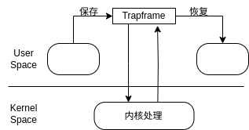
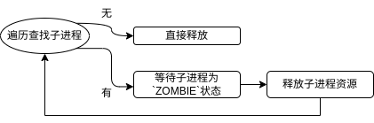

# 系统调用的设计实现
## 系统调用的流程
使用`ecall()` 指令负责系统调用。在用户态，我们将系统调用的参数保存在a0、a1寄存器中，使用a7寄存器保存系统调用号。当执行`ecall()`时，会主动触发一次异常（LA64下中断均实现为异常），并进入到异常处理流程中。在系统初始化的阶段，我们准备stvec寄存器保存“中断向量”。



在用户程序触发异常后，首先要将当前用户程序的表示当前所有寄存器的数据结构保存在另一个指定的`trapframe`结构中，然后进入内核操作。
为了处理系统调用，我们设计了一个函数指针数组，将对应系统调用号要执行的函数保存在对应的数组位值。通过系统调用号调用对应的函数，我们能够执行对应的系统调用操作。这样的操作使得系统可以根据不同的系统调用号来调用相应的功能函数，实现了系统调用的**灵活性和扩展性**。

## 一些系统调用的实现
### yield() 系统调用
`yield()`用于线程调度，主要功能是让出内核的进程调度，使得等待队列的第一个进程进入运行状态(`RUNNING`)。在异常处理程序结束后，内核在`usertrap()`中调用了`yield()`函数：
- 调用`schd`函数进入调度
- 保存当前的上下文保存在`p->context`中，然后切换到先前cpu调度器上的上下文 

在进程切换的部分，已经对`yield()`函数有所提及，此处不再赘述其代码。`yield()`函数首先获得进程的锁，防止进程在两个CPU核上运行，而一个进程只有一个内核栈，导致两个CPU核在同一个栈上运行代码。

然后，`yield()`函数将进程的状态改为`RUNNABLE`，表示当前进程要让出CPU然后切换到调度器进行调度。

### wait()系统调用
`wait()`用于等待子进程运行结束，主要用于内核需要杀死父进程时，需要等待该父进程的所有子进程都推出，才能结束父进程。子进程需要由父进程释放资源，否则需要为子进程寻找继父来释放资源。`wait()`函数传入的参数是一个指针类型，将子进程中`ZOMBIE`状态的进程的信息存放在该指针指向的地址中。

`wait()` 的实现比较简单，分别通过判断是否存在子进程实现：


- 首先遍历查看有无子进程，如果没有子进程则直接退出
- 如果有子进程，等待当前子进程僵死后释放资源；
- 如果没有僵死的子进程，则父进程陷入睡眠(SLEEPING)，直到子进程退出调用`exit()`唤醒父进程。

### read()系统调用
`read()`用于操作系统的输入功能，该系统调用负责从指定的文件描述符中读取内容。
- `fd`：文件描述符
- `buf`：读取文件使用的缓冲区
- `count`：将要读取的字节数

根据不同的文件描述符，操作系统可以处理`PIPE`、`DEVICE`和`ENTRY`的输入。
对于设备，操作系统使用`IOCSR`控制寄存器控制数据的流入和流出，同时，avx-loongarch64还有`devsw`的结构题数组用于维护各设备的IO情况。

### mmap()系统调用
`mmap()`用于将文件或者设备，主要是外存映射到内存中，便于内核通过访问虚拟地址直接访问外部设备。下面是`mmap()`模块的传入参数：
- `start`：表示映射到内存的起始位置，通过传入参数指定虚拟的起始地址；如果传入参数为NULL，则由系统自动分配一个可用的地址
- `len`：指定映射区域的长度。
- `prot`：指定映射区域的内存保护方式，指定进程对映射区域的访问权限。常见的权限有`PROT_WRITE`表示可写，用`PROT_READ`表示可读。
- `flags`：映射是否与其他进程共享的标志。
- `fd`：文件的句柄，通过此**文件描述符**确认要映射的文件
- `off`：文件的偏移量，表示从文件的哪个位置开始映射。

首先，函数获取当前文件的指针，并进行参数检查。如果文件描述符等参数非法，返回-1表示参数错误；然后，定义一个**权限变量**`perm`初始化权限为用户级别的权限，即`perm = PTE_PLV`。然后将权限和保护方式`prot`的内容合并，如果包含`PROT_WRITE`，则在`perm`中加入`PTE_W`和`PTE_D`标志表示访问。

接着，根据文件描述符（fd）获取当前打开文件（OFILES）的文件结构体指针。如果`fd`返回-1表示文件不存在。
调用`alloc_mmap_vma`函数给当前新进程分配虚拟内存空间（`vma`）的结构体，并传递相关参数。该函数在进程的虚拟内存区域创建一个新的映射区域，并返回`vma`结构体的指针。同理，如果分配失败则返回-1。
更新起始地址为分配的`vma` 的起始地址`vma->addr`。如果文件存在，那么计算mmap的大小，即使用映射文件的大小减去偏移量。如果`len`小于这个大小，则将`mmap_size`设置为`len`，保证不超过`len`的大小。然后将文件的偏移设置为给定的偏移量。

下一步，计算`mmap_size`对页面大小求余的结果，以及需要映射的页面数量。定义一个新的虚拟地址变量`va`，将其初始化为起始地址。在循环体中通过调用`experm()`函数将虚拟地址`va`映射到物理地址`pa`中，修改地址的权限。
在循环过程中，根据当前页是否为最后一页执行不同的操作：
- 如果不是最后一页，调用`fileread()`函数从文件中读取页面大小的数据写入`va`指向的内存中
- 否则调用`fileread()`调用剩下页面大小的数据，写入此时`va`指向的虚拟地址的内存，然后将剩余不到整页的空间清空。

循环结束后，调用`fileup`对文件结构体增加其引用计数，确保在`mmap`映射时文件不会关闭。下面是`alloc_mmap_vma()`函数的实现代码：
```c
struct vma *alloc_mmap_vma(struct proc *p, int flags, uint64 addr, uint64 sz,
                           int perm, int fd, uint64 f_off) {
  struct vma *vma = NULL;
  struct vma *find_vma = find_mmap_vma(p->vma);
  if (0 == addr && sz < find_vma->addr) {
    addr = PGROUNDDOWN(find_vma->addr - sz);
  }
  vma = alloc_vma(p, MMAP, addr, sz, perm, 1, NULL);
  if (NULL == vma) {
    printf("alloc_mmap_vma: alloc_vma failed\n");
    return NULL;
  }
  vma->fd = fd;
  vma->f_off = f_off;

  return vma;
}
```

`vma`结构体的实现如下所示。这个结构体用于表示进程的一个虚拟内存区域，包括该区域的类型、起始地址、结束地址、大小和权限设置等信息。`vma`之间通过双向链表进行链接。

```c
struct vma {
	enum segtype type; //分配的vma的作用是干什么
	int perm; //这个vma的权限是什么
	
	uint64 addr; //vma映射的内存地址是什么
	uint64 sz; //vma映射的大小是什么
	uint64 end; //vma映射的结束地址
	int flags; // vma进程的权限设置
	int fd;
	uint64 f_off;
	struct vma *prev; //链表结构，按照addr排序
	struct vma *next;
};
```

`vma`的相关函数实现在`vma.c`的模块中。函数`vma_init()`用于初始化进程的`vma`，返回指向`vma`结构体的指针。它接受一个指向进程结构体的指针作为参数，在函数内部，创建并分配一个vma结构体。然后将这个结构体与进程关联，创建一个初始的MMAP类型的vma；起始地址设置为`USER_MMAP_START`，大小为0。
函数`alloc_vma()`用于分配一个vma并将其插入到进程的vma链表中。它传入进程指针、vma类型、vma的起始地址addr、大小sz等作为参数。函数首先根据地址和大小检查是否已经存在冲突的vma，然后分配一个vma结构体。根据传入参数`alloc`的值进行内核分配或者映射。最后，根据传入参数为分配的vma结构体的每个字段赋值，插入到
该进程的vma链表中。
函数`find_mmap_vma`用于在给定的vma链表中查找类型为MMAP的vma，实现上为遍历链表。如果找到，返回该vma的指针；否则返回NULL。

### clone()系统调用
使用`clone()`创建一个子进程，用于完善已经实现的`fork()`函数。该函数传入`flags`（创建标志）、`stack`（指定的栈），父进程`id`和子进程的`sid`。
在`clone()`系统调用中，可以指定一个新的用户栈空间，接受一个预先分配的用户空间爱你的虚拟地址作为用户栈，然后改变子进程的`sp`字段为此指定的用户栈地址。

### times()系统调用
进程使用`p->utime`和`p->ktime`分别保存当前的用户态运行时间和内核态运行时间的数据。`times()`用于返回进程时间，输入参数为`tms`结构体，返回进程已经过去的tick数。其结构体和实现如下所示：
```c
struct tms
{
	long tms_utime;
	long tms_stime;
	long tms_cutime;
	long tms_cstime;
};

// 进程的时间统计信息
uint64 sys_times() {
  struct tms ptms;
  uint64 utms;
  argaddr(0, &utms);
  ptms.tms_utime = myproc()->utime;
  ptms.tms_stime = myproc()->ktime;
  ptms.tms_cstime = 1;
  ptms.tms_cutime = 1;
  struct proc *p;
  for (p = proc; p < proc + NPROC; p++) {
    acquire(&p->lock);
    if (p->parent == myproc()) {
      ptms.tms_cutime += p->utime;
      ptms.tms_cstime += p->ktime;
    }
    release(&p->lock);
  }
  copyout(myproc()->pagetable, utms, (char *)&ptms, sizeof(ptms));
  return 0;
}
```